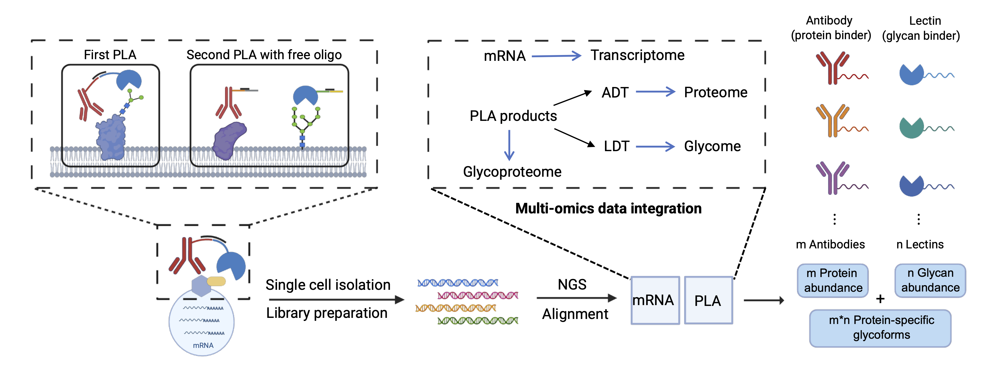

# Glycan-Prox-seq
**Single-cell measurement of glycoforms, proteins and mRNA reveals dynamic glycan remodeling during T cell differentiation**

  
   
  <em>Glycan-Prox-seq (GPS) workflow</em>

---

This repository contains code and data to **reproduce the main figures and analyses** in the Glycan-Prox-seq study.

Author: Junjie Xia

Email: jjxia@uchicago.edu

---

## Repository Structure

- `code_reproduce/` — Jupyter notebooks (`.ipynb`) and R scripts (`.R`) for reproducing figures  
  - `Fig1.ipynb` — Bulk GPS assay on WT and GnTI knock-out Expi293F cell lines
  - `Fig2.ipynb` — Single-cell plate-based GPS assay on Jurkat and Raji mixtures  
  - `Fig3_*.ipynb` — 10x GPS assay on human PBMCs, including clustering and annotation, ADT/LDT profiles, NK subset analysis.
  - `Fig4&5_pseudotime_analysis.ipynb` — pseudotime trajectory analysis on T cell populations
  - `Fig6_*.ipynb` — Glycosylation remodeling under external perturbation  
  - `Monocle_*.R` — trajectory inference with Monocle3  
  - `SingleR-based_annotation.R` — reference-based cell type annotation  
- `source_data/` — Source data and processed data tables used for figure reproduction  

---

---

## 🖥️ System Requirements

### Software Dependencies

| Language | Version | Key Packages |
|-----------|----------|--------------|
| **Python** | 3.10.11 | `scanpy 1.9.3`, `numpy 1.25.2`, `pandas 2.3.0`, `matplotlib 3.10.3`, `seaborn 0.12.2`, `scikit-learn 1.3.0`, `gseapy 1.1.9` |
| **R** | ≥ 4.2 | `Seurat_5.2.1`, `Monocle3_1.3.7`, `SingleR_2.6.0`, `ggplot2_3.5.1`|

### Operating Systems Tested
- macOS 13.7.8 (Ventura)  
- Ubuntu 22.04 LTS  

### Hardware Requirements
- Standard desktop or laptop computer (≥ 8 GB RAM recommended)  
- No GPU or non-standard hardware required  

### Versions Tested
- Python 3.10.11 (via Conda)  
- R 4.4.1  
- Tested on Apple M1 Pro
---

## Data Availability

Source data: All processed data supporting the findings of this study are provided with the manuscript.

Raw sequencing data and processed h5ad file: Available at the Gene Expression Omnibus (GEO) under accession number GSE307239.
